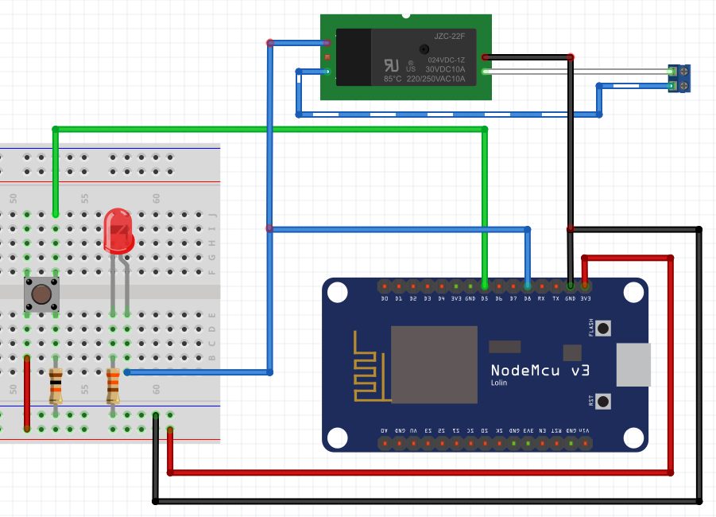

# 06 Botão com retenção de estado, relê e LED

Um programa que monitora o estado de um botão (*chave táctil*), de modo que seu acionamento alterna o funcionamento de um (módulo) relê e de um led montado externamente à placa de desenvolvimento, cujos estados são mantidos entre os acionamentos do botão. Quando o botão é acionado ocorre a troca de estado, acionando os dispositivosm até que o botão seja pressionado novamente. Mostra o uso de porta GPIO (*General Purpose Input Output*) como entrada digital ou como uma saída digital, além de variáveis para retenção de estado.

## Objetivo

Configuração e uso de uma entrada digital, conectada à um botão; e uma saída digital, conectada à um relê; mostrando o controle de dispositivos externos, de maior potência, ao NodeMCU com retenção de estado.

## Lista de Materiais

* Placa NodeMCU ESP8266 (30 pinos)
* Cabo USB-A -- micro-USB
* 01 Led (qualquer cor)
* 01 Chave táctil
* 01 Resistor 220 ohms (vermelho-vermelho-marron) ou 330 ohms (laranja-laranja-marrom)
* 01 Resistor 10K ohms (marron-preto-laranja)
* 01 Módulo relê (1 ou 2 canais) 5V
* Jumpers

> Observe que o MicroPython já deve ter sido instalado previamente na placa NodeMCU utilizada.

## Roteiro

Este roteiro requer uma montagem simples, além da conexão da placa NodeMCU ao computador, como na figura que segue.



Observe que o pino físico 20 (D8) do NodeMCU, que corresponde a GPIO15, será conectado ao ânodo do led (terminal positivo, mais longo). O cátodo do led (terminal negativo, mais curto) será conectado ao resistor (não tem polaridade), de maneira que fiquem em série. O outro terminal do resistor deve ser ligado ao pino físico 17 GND (*ground*) do NodeMCU, que é o terra do circuito.

O pino físico 22 (D6) do NodeMCU, que corresponde a GPIO12, será conectada à chave tactil, do mesmo lado que o resistor de 10K, o qual é conectado ao terra (pino físico 17 GND). O outro lado da chave táctil deve ser ligado ao pino físico 15 Vin (que é a alimentação *recebida pela placa*, ou seja 5V da conexão USB com o computador). As entradas GND e VCC do módulo relê devem ser ligadas, respectivamente, aos pinos físicos 17 e 15. A entrada IN ou IN1 deve ser conectada ao pino físico 20 (D8) do NodeMCU, juntamente com o led.

1. Efetue a montagem indicada. Confira todas as conexões.
2. Conecte a placa NodeMCU à porta USB de seu computador.
3. Abra o Thonny.
4. Observe se o console do interpretador Python é iniciado corretamente. Caso contrário: verifique em *Executar | Configurar interpretador* se o interpretador foi selecionado corretamente (MicroPython ESP8266) e se a porta de conexão está correta. Acione o botão *Stop* ou **CTRL+F2** para reiniciar a conexão.
5. Digite o sketch que segue.

```python
#
# 06_botao_led_rele.py
# Um botão, com manutenção de estado, para controle
# de um relê, com led externo de sinalização.
#
from machine import Pin
from time import sleep

led = Pin(15, Pin.OUT)
botao = Pin(12, Pin.IN)
estado = False
led.value(estado)
print('Controle:', estado)
ultimo = estado
try:
    while True:
        valor = botao.value()
        if valor and not ultimo:
            estado = not estado
            led.value(estado)
            print('Controle:', estado)
        ultimo = valor
        sleep(0.2)
except KeyboardInterrupt:
    led.value(0)
    print('Programa finalizado')
		  
```

6. Salve como "06_botao_led_rele.py".
7. Para executar acione o botão *Executar* ou **F5**.
8. Acione o botão e verifique o acendimento do led, a retenção de seu estado e a ativação correspondente do relê.

## Sugestões

* Adicione um segundo botão, de maneira a existirem dois controles independentes para dois led ou dois relês (se disponível).


