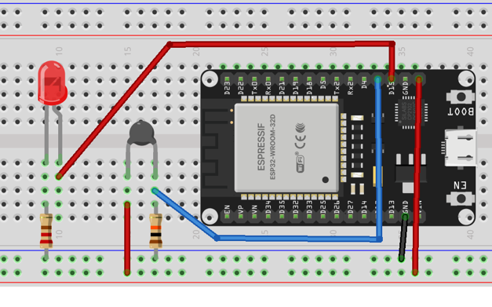

# 10 Conversão Analógica-Digital, termistor e LED

Este programa utiliza uma entrada analógica-digital para efetuar a leitura de um *termistor*, ou seja, um resistor variável conforme a temperatura detectada. O termistor possui dois terminais, sem polaridade, e funciona de duas maneiras:

- *Positive Temperature Coeficient* (PTC), quando sua resistência aumenta conforme a temperatura aumenta; 
- *Negative Temperature Coeficient* (NTC), quando sua resistência diminui conforme a temperatura aumenta.

Nesta experiência usaremos um NTC que será montado em série com um resistor de valor fixo, criando um divisor de tensão, cuja tensão variável tem relação com a temperatura. A junção do NTC e do resistor será conectada a entrada analógica do ESP32.

Nesse experimento vamos utilizar o recurso atenuação de sinal, que de maneira mais direta, seria para a leitura de valores tensão abaixo valor referência (de 3.3 V). Para isso usamos a função `atten()` e os seguintes valores constantes:
+ `ADC.ATTN_0DB`: Sem atenuação (100mV - 950mV)
+ `ADC.ATTN_2_5DB`: 2.5dB de atenuação (100mV - 1250mV)
+ `ADC.ATTN_6DB`: 6dB de atenuação (150mV - 1750mV)
+ `ADC.ATTN_11DB`: 11dB de atenuação (150mV - 2450mV)

Esta experiência mostra o uso do ADC disponível no ESP32, exibindo a temperatura detectada pelo NTC e também um led para alerta quando a temperatura for superior a 27˚C.

## Objetivo

Emprego de uma entrada analógica, incluindo o conversor analógico-digital correspondente, para utilização de um transdutor de temperatura (termistor NTC), com uso de um led de alerta para temperatura acima de um limiar (com uso de saída digital).

## Lista de Materiais

* Placa NodeMCU ESP32 (30 pinos)
* Cabo USB-A -- micro-USB
* 01 Termistor NTC 10K
* 01 Resistor 10K ohms (marron-preto-laranja)
* 01 Led vermelho
* 01 Resistor 330 ohms (laranja-laranja-marrom)
* Jumpers

## Roteiro

Este roteiro requer uma montagem simples, além da conexão da placa NodeMCU ao computador, como na figura que segue.



O pino físico 10 (3V3) do NodeMCU é conectado a um dos terminais do termistor NTC, que não tem polaridade. O segundo terminal do termistor NTC forma uma junção com o resistor de 10K e uma conexão ao pino 2, que corresponde ao conversor ADC disponível nesta placa. O outro terminal do resistor de 10K deve ser conectado ao terra (pino  GND, ou outro equivalente).

O pino físico 20 (D8 -> GPIO15) é conectado ao ânodo do led vermelho. O cátodo do led deve ser conectado a um dos terminais resistor de 330 ohms e o outro terminal ao terra (pino GND).

1. Efetue a montagem indicada. Confira todas as conexões.
2. Conecte a placa NodeMCU à porta USB de seu computador.
3. Abra o Thonny.
4. Observe se o console do interpretador Python é iniciado corretamente. Caso contrário: verifique em *Executar | Configurar interpretador* se o interpretador foi selecionado corretamente (MicroPython ESP8266) e se a porta de conexão está correta. Acione o botão *Stop* ou **CTRL+F2** para reiniciar a conexão.
5. Digite o sketch que segue.

```python
#
# 10_ADC_ntc.py
# Leitura analógica de um termistor (NTC), com led de alerta
# para temperatura alta.
#
from machine import Pin, ADC
from time import sleep
import math

ntc = ADC(Pin(2))
ntc.atten(ADC.ATTN_11DB)

led = Pin(15, Pin.OUT)

def temperatura():
    BETA = 3950
    valor_analog = ntc.read()
    temperatura_celsius = 1 / (math.log(1 / (4096 / valor_analog - 1)) / BETA + 1.0 / 298.15) - 273.15
    return temperatura_celsius

try:
    while True:
        temp = temperatura()
        print("Temperatura:", round(temp, 2), "°C")
        if temp > 27.0:
            led.on()
            print("Alerta de temperatura!!")
        else:
            led.off()
        sleep(4.0)
except KeyboardInterrupt:
    print('Programa finalizado')

```

6. Salve como "10_ADC_ntc.py".
7. Para executar acione o botão *Executar* ou **F5**.
8. Modifique temperatura no NTC segurando-o , verificando o acendimento do led de alerta e dos valores apresentados no console.

## Sugestões

* Altere o programa para o led seja aceso para outra temperatura.
* Modifique a montagem para acrescentar um segundo led (p.e., azul), que seja ativado quando a temperatura é menor do que 20˚C.
